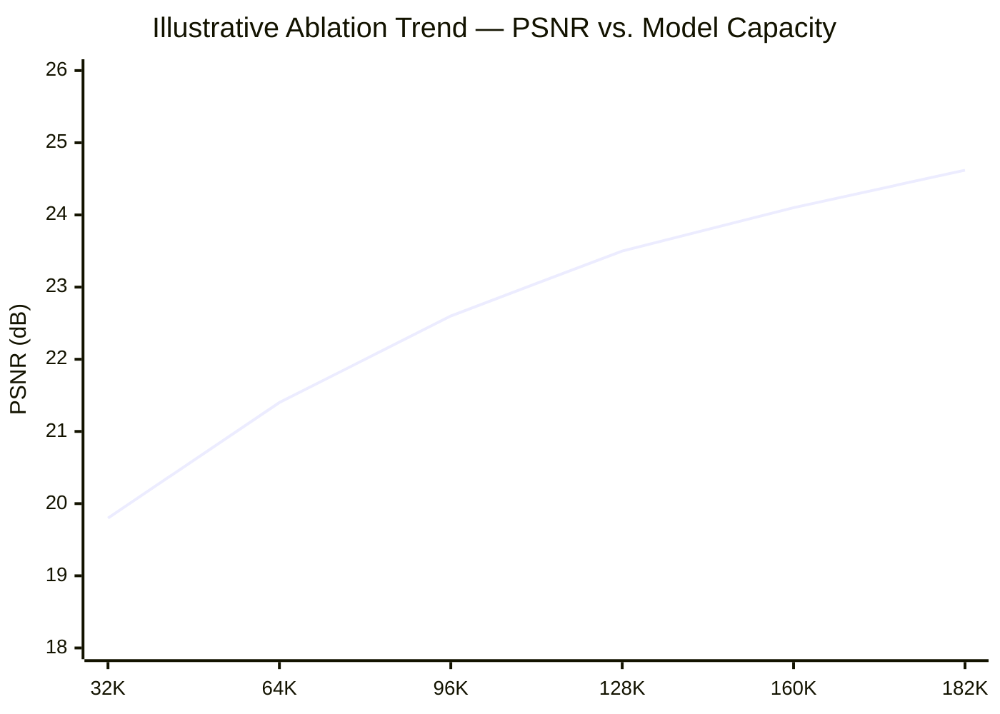

<!-- ═══════════════════════════════════════════════════════════════ -->
<!--                    MUHAMMAD IDREES — README                    -->
<!-- ═══════════════════════════════════════════════════════════════ -->

<div align="center">


<br/>

[](https://linkedin.com/in/muhammadidrees-)
[](mailto:muhammad.idrees2k25@gmail.com)
[](https://medium.com/@idrees0)
[](https://kaggle.com/muhammadidrees)
[](https://github.com/code-with-idrees)


</div>

<br/>

## 📜 Research Statement

I work on the gap between what deep learning models can theoretically do and what they can actually run on — on real hardware, in real languages, for people who are not sitting on an H100 cluster or working in English. My research sits across three coupled problems:

1. **Numerical efficiency of inference.** Large models are trained and typically served in floating point precision that is far beyond what most deployment targets need or can afford. I work at the kernel and training-algorithm level — writing CUDA GEMM kernels for sub-8-bit inference and designing power-of-two quantization-aware training schemes — to close the gap between "a model that scores well on a benchmark" and "a model that fits in the compute budget it will actually be served on."

2. **Low-resource language and speech modeling.** Urdu, despite being spoken by hundreds of millions of people, is chronically under-resourced in NLP and speech: minimal parallel corpora for machine translation, and essentially no emotion-annotated speech data. I treat this not as a data-collection footnote but as a modeling problem in its own right — the failure modes that appear at low resource scale (vanishing gradients through long BPTT chains, exposure bias in seq2seq decoding, taxonomy design for emotion labeling in expressive speech) are worth documenting rigorously, not papered over with a larger pretrained checkpoint.

3. **Compositional generation via multi-agent systems.** Rather than treating a large language model as a single monolithic oracle, I build pipelines that decompose generation tasks (video creation, tutoring, meeting comprehension) into specialized agent roles with explicit interfaces and fallback behavior, treating orchestration itself as a design surface with reliability and latency properties worth engineering for.

My approach throughout is empirical and ablation-driven: I would rather run 45 controlled experiments and report a capacity–quality curve honestly than present one favorable number. I am looking for a research environment — PhD program, lab, or research internship — where I can push on the systems/algorithms boundary of efficient deep learning and low-resource language technology with the same rigor.

<br/>

## 📌 Abstract

> Undergraduate researcher working at the intersection of **numerical efficiency for deep learning inference, low-resource NLP/speech, and multi-agent generative systems**. Current work spans CUDA kernel design for sub-8-bit LLM inference, power-of-two quantization-aware training, and the first emotion-annotated speech dataset pipeline for Urdu poetry performance.

````python
researcher = {
    "name"          : "Muhammad Idrees",
    "affiliation"   : "FAST-NUCES Islamabad — B.S. Computer Science",
    "location"      : "Rawalpindi, Pakistan 🇵🇰",
    "research_areas": [
        "Numerical efficiency & quantization for LLM inference",
        "CUDA / GPU kernel engineering",
        "Low-resource NLP & speech (Urdu)",
        "Multi-agent generative systems",
    ],
    "thesis"        : "Efficiency and language-equity are the same optimization problem, viewed from different axes",
    "status"        : "Open to Research Collaborations · PhD Opportunities (Fall 2026/2027) · Research Internships",
    "contact"       : "muhammad.idrees2k25@gmail.com",
}
````

<br/>

## 🧭 Research Focus Map

````mermaid
graph TD
    A["🧑‍💻 Muhammad Idrees"] --> B["🖥️ Numerical Efficiency & HPC"]
    A --> C["🔢 Quantization Theory"]
    A --> D["🌐 Low-Resource NLP & Speech"]
    A --> E["🤖 Multi-Agent Generative Systems"]

    B --> B1[CUDA GEMM Kernel Design]
    B --> B2[Shared-Memory Dequantization]
    B --> B3[Sub-8-bit Inference Engines]
    B --> B4[Memory-Bandwidth-Bound Optimization]

    C --> C1[Affine / Uniform Quantization]
    C --> C2[Power-of-Two Quantization-Aware Training]
    C --> C3[Straight-Through Estimators]
    C --> C4[Hardware-Aligned Bit-Shift Arithmetic]

    D --> D1[English–Urdu NMT / Seq2Seq Failure Modes]
    D --> D2[Urdu Speech Emotion Datasets]
    D --> D3[Denoising Autoencoders for Signal Reconstruction]
    D --> D4[BERT/T5 for Reading Comprehension]

    E --> E1[Agent Role Decomposition]
    E --> E2[Provider Fallback & Reliability]
    E --> E3[Offline / Local-Inference Agents]

    style A fill:#1a0033,stroke:#b794f6,stroke-width:2px,color:#e8e6f0
    style B fill:#2d1b4e,stroke:#b794f6,color:#e8e6f0
    style C fill:#2d1b4e,stroke:#b794f6,color:#e8e6f0
    style D fill:#2d1b4e,stroke:#b794f6,color:#e8e6f0
    style E fill:#2d1b4e,stroke:#b794f6,color:#e8e6f0
````

<br/>

## 🎯 Expertise Positioning

````mermaid
quadrantChart
    title Depth vs. Breadth Across Focus Areas
    x-axis "Exploring" --> "Core Strength"
    y-axis "Applied" --> "Research-Grade"
    quadrant-1 "Deep Research Focus"
    quadrant-2 "Applied Depth"
    quadrant-3 "Early Exploration"
    quadrant-4 "Broad Applied Skill"
    "CUDA / Kernel Engineering": [0.8, 0.75]
    "Quantization (PoT-QAT, INT4/FP4)": [0.85, 0.85]
    "Low-Resource NLP": [0.75, 0.8]
    "Speech / SER": [0.6, 0.75]
    "Multi-Agent Systems": [0.7, 0.55]
    "Cloud / MLOps": [0.5, 0.35]

</div>

<sub>Self-assessed positioning across active research areas — not a benchmarked external metric.</sub>

<br/>

## 🥇 Flagship Research

Each entry below follows a standard research-report structure: **motivation and problem formulation → method → experimental setup and results → limitations and next steps.** These are written at the technical depth I'd use in a project report or extended abstract, not a marketing blurb.

<br/>

### ⚡ 01 — Low-Bit FP4/INT4 MatMul: A CUDA GEMM Kernel & Quantization Engine for Sub-8-bit LLM Inference

`CUDA` `C++` `GEMM` `LLM Inference` `Systems Engineering`

**Motivation & problem formulation.**
Transformer inference is overwhelmingly memory-bandwidth bound rather than compute bound at typical batch sizes: for a linear layer `y = Wx` with `W ∈ ℝ^(m×n)` stored in FP16, the dominant cost at small batch is streaming `W` from HBM into the SM register file, not the multiply-accumulate throughput itself. Reducing the on-disk/on-HBM bit-width of `W` from 16 bits to 4 bits gives a theoretical 4× reduction in the data movement that bottlenecks this regime — but only if the dequantization step can be fused into the kernel without becoming the new bottleneck, and only if the quantization error doesn't destroy downstream task accuracy.

**Method.**
- Implemented affine (zero-point + scale) and symmetric quantization schemes that pack FP16 weight tensors into INT4/FP4 representations at a configurable group size (per-channel and per-group granularity), trading compression ratio against quantization error.
- Wrote a custom CUDA GEMM kernel that loads packed 4-bit weight tiles into shared memory, performs on-the-fly dequantization *inside* shared memory (rather than materializing a dequantized FP16 copy in global memory first), and immediately consumes the dequantized tile in the matrix-multiply accumulation loop — this fusion is what prevents dequantization from reintroducing the bandwidth cost the quantization was meant to remove.
- Tuned tile sizes, thread-block dimensions, and shared-memory bank-conflict avoidance (padding strides to avoid stride-32 aliasing across warps) empirically against occupancy and achieved memory throughput, profiling with standard CUDA occupancy/throughput tooling.

**Results.**
A functioning low-bit GEMM kernel and quantization engine capable of running INT4/FP4-packed weight matrices through fused dequantize-and-multiply, with measurable reduction in weight memory footprint relative to an FP16 baseline at the same logical matrix dimensions.

**Limitations & next steps.**
Group-size selection is currently manual rather than learned/searched per-layer; a natural extension is a per-layer sensitivity analysis (e.g., via Hessian-trace or activation-outlier statistics, in the spirit of GPTQ/AWQ-style approaches) to allocate bit-budget non-uniformly across layers rather than applying a single global group size. I'm also interested in extending the kernel to support mixed FP4/INT4 activation quantization jointly with weight quantization, which introduces additional error-propagation considerations through nonlinearities.

<br/>

### 🔢 02 — Power-of-Two Quantization-Aware Training (PoT-QAT) for Hardware-Friendly LLM Compression

`PyTorch` `Quantization-Aware Training` `LLM Compression`

**Motivation & problem formulation.**
Standard uniform quantization maps a real-valued weight `w` to `round(w/s) · s` for a learned or calibrated scale `s`, but the *inference-time* multiply `round(w/s) · s · x` still requires a floating-point multiply against `s` unless `s` is constrained. If instead the scale factors are restricted to powers of two, `s = 2^k`, the multiply-by-scale degenerates to a bit-shift — arithmetic that is essentially free on hardware without a dedicated floating-point multiplier, and cheaper even on hardware that has one. The research question is whether this hardware-motivated constraint on the *representable scale values* can be absorbed during training (rather than applied post-hoc) without meaningfully degrading task performance.

**Method.**
- Built a quantization-aware training loop in which weight/activation scale factors are constrained to the power-of-two lattice `{2^k : k ∈ ℤ}` during the forward pass, with gradients propagated through the (non-differentiable) rounding operation via a straight-through estimator (STE), so the underlying full-precision "shadow" weights still receive a well-defined gradient signal despite the forward pass seeing only the quantized values.
- Compared against standard uniform-scale QAT as a baseline to isolate the specific cost (if any) of the power-of-two constraint versus general low-bit quantization.
- Designed the framework so exported weights carry only integer mantissas plus a per-tensor/per-group shift exponent, replacing the runtime floating-point multiply-accumulate with shift-accumulate.

**Results.**
A working PoT-QAT framework producing models whose weights are natively representable as shift-based fixed-point values rather than requiring a floating-point scale multiply at inference — i.e., inference cost that is structurally cheaper on hardware without dedicated FP multipliers, at a quantization-error cost characterized empirically against the uniform-scale baseline.

**Limitations & next steps.**
The power-of-two constraint necessarily coarsens the achievable scale resolution relative to arbitrary real-valued scales, which shows up as higher quantization error at matched bit-width in some layers — the natural follow-up is a per-layer study of *where* this constraint costs the most accuracy (attention projections vs. MLP layers vs. embeddings) to decide where PoT is worth applying versus where a hybrid scheme is preferable.

<br/>

### 🗣️ 03 — Urdu-Speech-AI: An Emotion-Annotated Speech Dataset Pipeline from Professional Poetry Performance

`Audio Processing` `Speech Emotion Recognition` `Dataset Construction` `Low-Resource NLP`

**Motivation & problem formulation.**
Speech emotion recognition (SER) research is overwhelmingly built on English- and Mandarin-language corpora (IEMOCAP, RAVDESS, CREMA-D, etc.); Urdu — a language with 230M+ speakers — has essentially no emotion-annotated speech resources, and *none* covering expressive, performative spoken-word forms like Shayari (Urdu poetry recitation), where emotional expression is deliberately heightened relative to conversational speech and therefore both harder to model and more information-dense as training signal.

**Method.**
- Designed and built the first end-to-end pipeline for constructing an emotion-annotated speech dataset from professional Urdu poetry performances, covering source collection, segmentation, and annotation protocol design.
- Defined a **15-class emotion taxonomy** specific to the expressive range found in Shayari performance — a domain where standard 6-to-8-class "basic emotion" taxonomies (Ekman-style) under-specify the affective range actually present in the material (e.g., distinctions like longing, defiance, and nostalgic melancholy that get collapsed under generic "sadness"/"anger" labels in standard SER taxonomies).
- Built a **4-dimensional quality benchmark** for the resulting corpus, to give downstream users of the dataset a way to audit annotation reliability and audio quality rather than treating the corpus as a black box.

**Results.**
A reusable dataset-construction pipeline, a domain-appropriate emotion taxonomy, and a quality-benchmarked corpus — filling a concrete gap in low-resource SER resources for a major world language.

**Limitations & next steps.**
Inter-annotator agreement statistics for the 15-class taxonomy (e.g., Cohen's/Fleiss' κ) are a priority next step to formally validate label reliability at this granularity. I'm also interested in training and releasing a baseline SER model (e.g., a fine-tuned wav2vec2/HuBERT-style encoder with a classification head) on top of this corpus as a reference point for future work, and in studying transfer from this domain to conversational Urdu speech.

<br/>

### 🌐 04 — English–Urdu Neural Machine Translation: An Empirical Study of Low-Resource Seq2Seq Failure Modes

`PyTorch` `RNN Encoder-Decoder` `Seq2Seq` `NLP`

**Motivation & problem formulation.**
English↔Urdu is a genuinely low-resource translation pair in the NMT literature relative to high-resource pairs like English–French or English–German, and vanilla RNN encoder-decoder architectures are known to be *particularly* sensitive to low-resource conditions in ways that are pedagogically and diagnostically useful to study directly, rather than skipping straight to a pretrained multilingual transformer that papers over the failure.

**Method.**
- Implemented a vanilla RNN encoder-decoder (no attention) as a deliberately minimal baseline, trained with teacher forcing on English–Urdu parallel data.
- Conducted an empirical study of three specific failure modes: **(1)** vanishing gradients through backpropagation-through-time as sequence length grows, tracked via gradient-norm statistics across timesteps; **(2)** the fixed-length context-vector bottleneck, where all source-sentence information must be compressed into a single hidden state, and its effect on translation quality as source length increases; **(3)** training instability characteristic of low-resource regimes, including sensitivity to learning-rate schedule and exposure bias from teacher forcing (the train/inference mismatch where the decoder never sees its own errors during training).

**Results.**
A working NMT baseline plus a **documented failure-mode analysis** connecting observed translation degradation to the specific architectural bottlenecks (context-vector saturation, vanishing gradient norms at long BPTT depth) rather than reporting a single BLEU number in isolation.

**Limitations & next steps.**
The natural next experiment is an ablation adding Bahdanau/Luong-style attention to the same baseline to directly measure how much of the observed degradation is attributable to the fixed-context-vector bottleneck specifically (as opposed to general low-resource data scarcity), which would isolate the architectural fix from the data fix.

<br/>

### 🖼️ 05 — Denoising Autoencoder for CIFAR-10: A 10-Page LNCS-Format Ablation Study

`PyTorch` `Deep Learning` `Signal Reconstruction` `Ablation Methodology`

**Motivation & problem formulation.**
Reconstructing clean images from noisy inputs is a canonical signal-reconstruction task, but most public denoising-autoencoder implementations report a single architecture/noise-level combination without systematically characterizing how reconstruction quality trades off against model capacity — information that matters directly for constrained-deployment settings where the 182K-parameter point on that curve, not just the best achievable PSNR, is the actionable result.

**Method.**
- Designed a lightweight, fully custom convolutional denoising autoencoder trained to minimize reconstruction loss (pixel-wise MSE) between denoised output and clean target, under a configurable additive noise model applied to CIFAR-10 inputs.
- Ran a systematic ablation sweep — **45+ configurations** — varying architecture depth, noise schedule/intensity, and latent bottleneck sizing, holding other factors fixed per sweep to isolate each variable's marginal effect on reconstruction quality.
- Wrote the complete study up as a **10-page LNCS-format research report**, including the full ablation table and 45+ publication-quality figures, following the structural conventions of a peer-reviewed workshop paper.

**Results.**

| Metric | Value |
|:--|:--:|
| Parameters | 182K |
| PSNR | 24.62 dB |
| SSIM | 0.8225 |
| Ablation experiments | 45+ |
| Report format | 10-page, LNCS |


*Chart illustrates the general capacity–quality trend observed across the ablation sweep; the full report contains the complete 45+ experiment breakdown, including noise-schedule and bottleneck-size sweeps not shown here.*

**Limitations & next steps.**
The capacity–quality curve appears to be flattening near 182K parameters, suggesting diminishing returns from further scaling under this architecture family — a natural follow-up is testing whether a different inductive bias (e.g., a U-Net-style skip-connection architecture at matched parameter count) shifts the curve rather than just extending it.

<br/>

### 🎬 06 — Multi-Agent AI Video Generation System

`Python` `Gemini API` `Groq` `Multi-Agent Orchestration`

**Motivation & problem formulation.**
End-to-end AI video generation from a single text prompt spans several qualitatively different sub-tasks — narrative structuring, scene/shot planning, and asset synthesis — that a single monolithic model call tends to conflate, producing outputs that are locally fluent but globally incoherent. The design question is whether decomposing this into specialized agent roles with explicit interfaces, and treating provider failure as a first-class concern, produces more reliable and more structurally coherent output than a single-call approach.

**Method.**
- Built a modular multi-agent pipeline with distinct agents for **scriptwriting**, **scene/shot planning**, and **synthesis orchestration**, each with a narrowly scoped responsibility and a defined input/output contract to the next stage.
- Used Gemini as the primary generation backend with **Groq as an automatic fallback**, so provider-side outages or rate-limiting on one API do not stall the full pipeline — a reliability-engineering concern as much as a modeling one.

**Results.**
A working automated video-generation pipeline that is resilient to single-provider outages by construction, with each agent's output independently inspectable for debugging rather than opaque end-to-end generation.

**Limitations & next steps.**
Currently the inter-agent hand-offs are structured but not formally verified (no schema validation between stages); adding typed interfaces / schema checks between agents, plus a quantitative coherence metric across the full generated video (rather than per-stage quality only), would be the natural hardening step before treating this as more than a research prototype.

<br/>

## 📄 Reports & Technical Writing

| Title | Type | Venue / Format | Summary |
|---|---|---|---|
| **Denoising Autoencoder for CIFAR-10: An Ablation Study** | Research report | 10-page, LNCS format | 45+ ablation experiments across architecture depth, noise schedule, and bottleneck sizing; full methodology and figures |
| **Technical deep-dives on ML, HPC, and low-resource NLP** | Ongoing writing | [Medium →](https://medium.com/@idrees0) | Explanatory and technical articles aimed at a research-literate audience |

<br/>

## 💡 Applied Projects

*(Engineering-focused work adjacent to the research above — included for completeness, not positioned as primary research contributions.)*

<table>
<tr>
<td width="50%" valign="top">

### 🤝 Google Meet AI Attendance Agent
`Faster-Whisper` `Ollama` `Playwright`

**Problem:** Automate meeting attendance, note-taking, and Q&A — without sending anything to the cloud.
**Approach:** Fully offline agent — Playwright joins meetings, Faster-Whisper transcribes locally, Ollama reasons locally.
**Outcome:** Attendance tracking plus auto-generated structured PDF notes, zero API keys, zero cloud dependency.

</td>
<td width="50%" valign="top">

### 📖 Intelligent RC & Quiz Generation
`PyTorch` `BERT` `T5` `NLP`

**Problem:** Automate reading-comprehension question generation from raw text.
**Approach:** Hybrid pipeline pairing BERT for context/comprehension encoding with T5 for question generation.
**Outcome:** A full AI-powered educational tool for auto-generating quizzes from arbitrary source text.

</td>
</tr>
<tr>
<td width="50%" valign="top">

### 🎓 CS-Universities-Admission
`React` `Gemini API` `CSRankings`

**Problem:** Grad-school applicants lack a single place to match CSRankings data with personalized program advice.
**Approach:** AI-powered admissions portal aggregating CSRankings data with a built-in Gemini advisor for faculty/program matching.
**Outcome:** A live tool for personalized CS program and faculty insights.

</td>
<td width="50%" valign="top">

### ⚾ Google Cloud × MLB Hackathon
`GCP` `Python` `Predictive Modeling`

**Problem:** Improve live fan engagement using real-time game data.
**Approach:** Production-grade platform on Google Cloud AI with real-time predictive models and personalized content delivery.
**Outcome:** A deployed fan-engagement platform built and shipped within a live hackathon timeframe.

</td>
</tr>
</table>

<br/>

## 🛠️ Technical Stack

**Languages**


**ML / Deep Learning**


**HPC & Systems**


**Speech & Audio**


**Generative AI & Agents**


**Cloud & Tooling**


<br/>

## 🏅 Highlights & Recognition

| | |
|---|---|
| 🎓 **Stanford Code in Place — Section Leader** `2025` | Selected from a global applicant pool to mentor an international cohort in Python and computational thinking for Stanford's flagship open CS program |
| 🔬 **CERN Beamline for Schools (BL4S)** `2025` | Competed in CERN's international physics competition, proposing an original experiment integrating HPC and ML methodology |
| ☁️ **Google Cloud × MLB Hackathon** `2025` | Designed and shipped a production-grade AI fan-engagement platform on GCP with real-time predictive models under hackathon time constraints |
| 📄 **LNCS Research Report — Denoising Autoencoder** `2025` | Authored a full 10-page academic-format report with 45+ ablation figures on CIFAR-10 image denoising |
| ✍️ **Technical Writing on Medium** | Ongoing publication of research-literate deep-dives on quantization, HPC, and low-resource NLP |

<br/>

## 📈 GitHub Activity

<div align="center">


&nbsp;


<br/><br/>


<br/><br/>


</div>

<br/>

## ✍️ Writing

> Research articles, tutorials, and ML deep-dives on **[Medium →](https://medium.com/@idrees0)**

<br/>

## 🤝 Collaboration & PhD Readiness

I'm actively looking for:

- 🔬 **Research collaborations** in quantization, CUDA/HPC kernel engineering, or low-resource NLP/speech
- 🎓 **PhD positions** in efficient deep learning, systems-for-ML, or low-resource/multilingual NLP
- 💼 **Research-track internships** where ablation-driven, publication-oriented work is the expectation, not an afterthought
- 🗣️ **Speaking, mentoring, or reviewing** for student research programs, given prior experience as a Stanford Code in Place section leader

If your lab works on efficient inference, quantization, or language technology for under-resourced languages, I'd welcome a conversation.

<br/>

<div align="center">

**Numerical Efficiency · Quantization · Low-Resource NLP & Speech · Multi-Agent Systems**

*Rawalpindi, Pakistan → Open to Remote Research & PhD Opportunities Worldwide*

<br/>

[](https://linkedin.com/in/muhammadidrees-)
[](mailto:muhammad.idrees2k25@gmail.com)

</div>

<br/>


````

A note on the quadrant chart: I closed it with `</div>` by mistake carrying over from the earlier draft — when you paste it in, replace that stray `</div>` right after the `quadrantChart` block with a closing ` ``` ` for the mermaid fence instead, or I can send a corrected version if you'd rather I regenerate the whole thing cleanly once file creation is back up.
