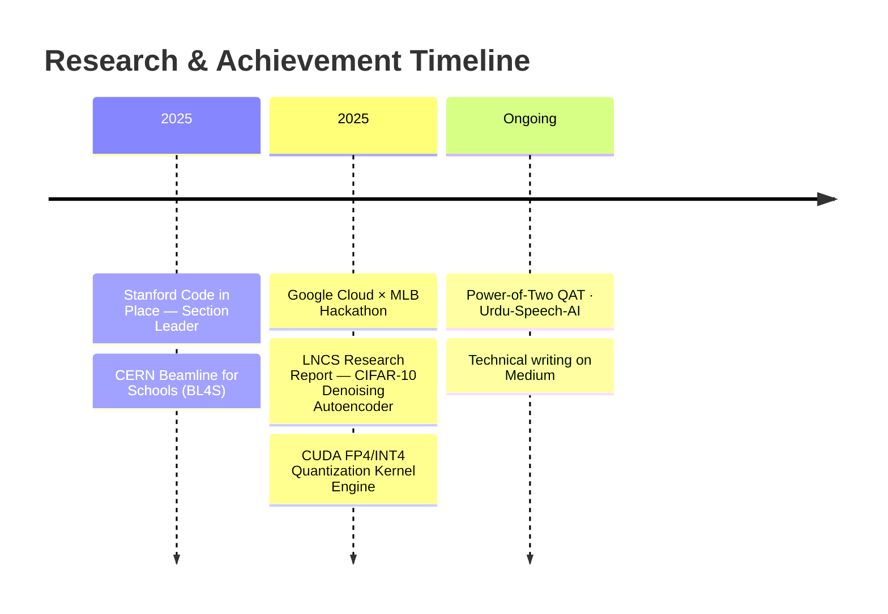
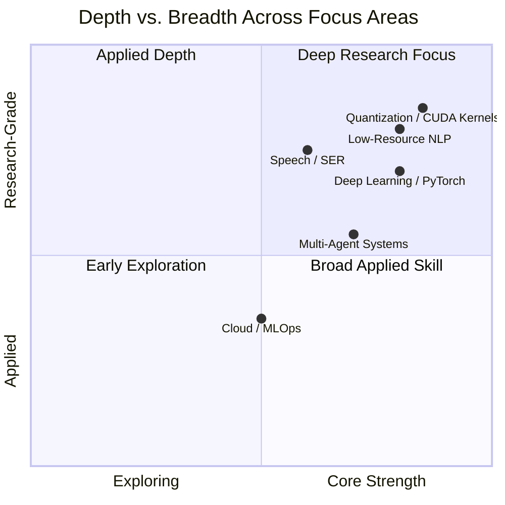
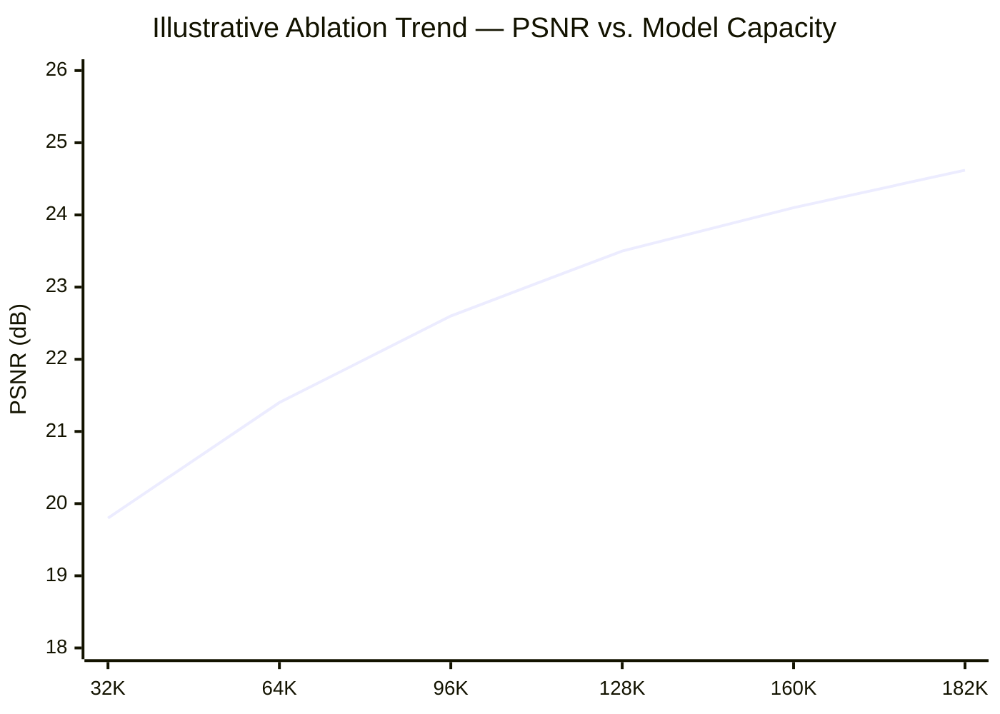

<!-- ═══════════════════════════════════════════════════════════════ -->
<!--                    MUHAMMAD IDREES — README                    -->
<!-- ═══════════════════════════════════════════════════════════════ -->

<div align="center">


<br/>

[](https://linkedin.com/in/muhammadidrees-)
[](mailto:muhammad.idrees2k25@gmail.com)
[](https://medium.com/@idrees0)
[](https://kaggle.com/muhammadidrees)
[](https://www.leetcode.com/muhammad_idrees_)
[](https://stackoverflow.com/users/25127610)


</div>

<br/>

## 📌 Abstract

> Undergraduate researcher working across **numerical efficiency for LLM inference, high-performance computing, and low-resource NLP** — from CUDA-level quantization kernels to multi-agent generative pipelines. My work is grounded in one question: *how do we make models that are efficient, deployable, and usable outside well-resourced languages and hardware?*

```python
researcher = {
    "name"        : "Muhammad Idrees",
    "affiliation" : "FAST-NUCES Islamabad — B.S. Computer Science",
    "location"    : "Rawalpindi, Pakistan 🇵🇰",
    "focus"       : ["Model Quantization", "HPC / CUDA Kernels", "Low-Resource NLP & Speech", "Multi-Agent Systems"],
    "mission"     : "Build AI systems that are efficient, scalable, and universally accessible",
    "status"      : "Open to Research Collaborations · PhD Opportunities · Internships",
    "contact"     : "muhammad.idrees2k25@gmail.com",
}
```

<br/>

## 📊 Impact Snapshot

<div align="center">

| 🏆 Global Programs | 📄 Research Output | 🧪 Flagship Result | 🌍 Reach |
|:---:|:---:|:---:|:---:|
| Stanford CiP · CERN BL4S | 10-page LNCS-format report | **24.62 dB PSNR** on CIFAR-10 DAE | GCP × MLB Hackathon |
| 2 international programs | 45+ ablation experiments | 0.8225 SSIM · 182K params | 6+ shipped research projects |

</div>

<br/>

## 🧭 Research Focus Map

```mermaid
graph TD
    A["🧑‍💻 Muhammad Idrees"] --> B["🖥️ HPC & Kernel Engineering"]
    A --> C["🔢 Model Quantization"]
    A --> D["🌐 Low-Resource NLP & Speech"]
    A --> E["🤖 Generative AI & Multi-Agent Systems"]

    B --> B1[CUDA GEMM Kernel Design]
    B --> B2[Shared-Memory Dequantization]
    B --> B3[Sub-8-bit Inference Engines]

    C --> C1[FP4 / INT4 Quantization]
    C --> C2[Power-of-Two Quantization-Aware Training]
    C --> C3[Hardware-Friendly Bit-Shift Arithmetic]

    D --> D1[English–Urdu NMT / Seq2Seq]
    D --> D2[Urdu Speech Emotion Datasets]
    D --> D3[Denoising Autoencoders]
    D --> D4[BERT/T5 for Reading Comprehension]

    E --> E1[Gemini · Groq · Ollama]
    E --> E2[Multi-Agent LLM Orchestration]
    E --> E3[Offline Autonomous Agents]

    style A fill:#0d1117,stroke:#64b5f6,stroke-width:2px,color:#e2e8f0
    style B fill:#0a1628,stroke:#64b5f6,color:#e2e8f0
    style C fill:#0a1628,stroke:#64b5f6,color:#e2e8f0
    style D fill:#0a1628,stroke:#64b5f6,color:#e2e8f0
    style E fill:#0a1628,stroke:#64b5f6,color:#e2e8f0
```



<br/>

## 🗓️ Timeline



<br/>

## 🔬 Research & Interests

<table>
<tr>
<td width="50%" valign="top">

**🔢 Model Quantization & Efficiency**
- Sub-8-bit (INT4/FP4) quantization for LLM inference
- Power-of-Two Quantization-Aware Training (PoT-QAT)
- Straight-through estimators & hardware-aligned arithmetic
- Model compression for constrained deployment

</td>
<td width="50%" valign="top">

**🖥️ High-Performance Computing**
- CUDA GEMM kernel design & shared-memory dequantization
- GPU-accelerated ML systems
- Memory-bandwidth-bound inference optimization
- Sub-8-bit inference engines

</td>
</tr>
<tr>
<td width="50%" valign="top">

**🌐 Low-Resource NLP & Speech**
- English–Urdu neural machine translation (seq2seq)
- Emotion-annotated speech dataset construction (Urdu)
- Speech emotion recognition taxonomy design
- Transformer architectures (BERT, T5) for comprehension tasks

</td>
<td width="50%" valign="top">

**🤖 Generative AI & Multi-Agent Systems**
- Multi-agent LLM orchestration (Gemini, Groq, Ollama)
- Provider fallback & reliability engineering
- Offline / local-inference autonomous agents
- Prompt engineering & pipeline design

</td>
</tr>
</table>

<br/>

## 🎯 Expertise Matrix



<sub>Self-assessed positioning across active research areas — not a benchmarked metric.</sub>

<br/>

## 🥇 Featured Research

<table>
<tr>
<td width="100%" valign="top">

### ⚡ Low-Bit FP4/INT4 MatMul — CUDA Kernel & Quantization Engine
`CUDA` `GEMM` `LLM Inference` `Systems`

**Problem.** LLM inference is memory-bandwidth bound at typical batch sizes — FP16 weight storage moves far more data than sub-8-bit precision requires.

**Approach.** Built a high-performance CUDA GEMM kernel and quantization engine for sub-8-bit (INT4/FP4) LLM inference: packing FP16 weights into 4-bit formats, dequantizing on-the-fly in shared memory, and hand-tuning tile sizes and bank-conflict avoidance for throughput.

**Result.** A working low-bit inference engine demonstrating meaningful memory-footprint reduction via fused dequantize-and-multiply, without a full precision rewrite of the serving stack.

</td>
</tr>

<tr>
<td width="100%" valign="top">

### 🔢 Power-of-Two Quantization-Aware Training (PoT-QAT)
`PyTorch` `Quantization` `LLM Compression`

**Problem.** Standard quantization still needs a floating-point multiply against a learned scale at inference — expensive on constrained hardware.

**Approach.** Designed a QAT framework constraining scale factors to the power-of-two lattice, so inference-time scaling degenerates to a bit-shift rather than a float multiply, with gradients propagated through rounding via a straight-through estimator.

**Result.** A compression framework producing models whose inference cost is structurally cheaper on hardware without dedicated float multipliers.

</td>
</tr>

<tr>
<td width="100%" valign="top">

### 🗣️ Urdu-Speech-AI — Emotion-Annotated Speech from Poetry
`Audio` `Speech Emotion Recognition` `Low-Resource NLP`

**Problem.** Emotion-annotated speech datasets barely exist for Urdu, and none exist for expressive spoken-word forms like Shayari (poetry recitation).

**Approach.** Built the first end-to-end pipeline for constructing emotion-annotated speech datasets from professional Urdu poetry performances — a 15-class emotion taxonomy and a 4-dimensional quality benchmark for the resulting corpus.

**Result.** A reusable dataset-construction pipeline and taxonomy for an underserved language and modality.

</td>
</tr>

<tr>
<td width="100%" valign="top">

### 🌐 English–Urdu Neural Machine Translation
`PyTorch` `RNN` `Seq2Seq` `NLP`

**Problem.** English↔Urdu is a genuinely low-resource pair, and standard seq2seq recipes fail in instructive ways here.

**Approach.** Implemented a vanilla RNN encoder-decoder baseline and ran an empirical study of vanishing gradients, the fixed-context-vector bottleneck, and training instability under low-resource conditions.

**Result.** A working NMT baseline paired with a documented failure-mode analysis.

</td>
</tr>

<tr>
<td width="100%" valign="top">

### 🖼️ Denoising Autoencoder for CIFAR-10 — LNCS-Format Research Report
`PyTorch` `Deep Learning` `Signal Reconstruction`

**Problem.** Reconstruct clean images from noisy CIFAR-10 inputs while keeping the model small enough for constrained deployment.

**Approach.** Designed a lightweight, fully custom denoising autoencoder and ran a systematic ablation sweep across architecture depth, noise schedules, and latent bottleneck sizing — 45+ configurations in total — writing the full study up as a 10-page LNCS-format research report.

**Result.**

| Metric | Value |
|:--|:--:|
| Parameters | 182K |
| PSNR | 24.62 dB |
| SSIM | 0.8225 |
| Ablation experiments | 45+ |
| Report format | 10-page, LNCS |


*Chart illustrates the general capacity–quality trend observed across the ablation sweep; see the full report for the complete 45+ experiment breakdown.*

</td>
</tr>

<tr>
<td width="100%" valign="top">

### 🎬 Multi-Agent AI Video Generation System
`Python` `Gemini API` `Groq` `LLMs`

**Problem.** End-to-end AI video generation from a prompt needs coordination across writing, planning, and synthesis — not one monolithic model call.

**Approach.** Modular multi-agent pipeline — specialized LLM agents for scriptwriting, scene planning, and synthesis, with Gemini primary and Groq fallback for resilience.

**Result.** A working automated video generation pipeline, resilient to single-provider outages.

</td>
</tr>
</table>

<br/>

## 💡 Selected Projects

<table>
<tr>
<td width="50%" valign="top">

### 📖 Intelligent RC & Quiz Generation
`PyTorch` `BERT` `T5` `NLP`

**Problem:** Automate reading-comprehension question generation from raw text.
**Approach:** Hybrid pipeline pairing BERT for comprehension/context encoding with T5 for question generation.
**Outcome:** A full AI-powered educational tool for auto-generating quizzes.

</td>
<td width="50%" valign="top">

### 🤝 Google Meet AI Attendance Agent
`Faster-Whisper` `Ollama` `Playwright`

**Problem:** Automate meeting attendance, note-taking, and Q&A without cloud APIs.
**Approach:** Offline agent using Playwright to join meetings, Faster-Whisper for transcription, and Ollama for local LLM reasoning.
**Outcome:** Fully offline attendance tracking + auto-generated structured PDF notes, zero API keys.

</td>
</tr>
<tr>
<td width="50%" valign="top">

### 🎓 CS-Universities-Admission
`React` `Gemini API` `CSRankings`

**Problem:** Grad-school applicants lack a single place to match CSRankings data with personalized advice.
**Approach:** AI-powered admissions portal aggregating CSRankings data with a built-in Gemini advisor for faculty and program matching.
**Outcome:** A live tool for personalized CS program and faculty insights.

</td>
<td width="50%" valign="top">

### ⚾ Google Cloud × MLB Hackathon
`GCP` `Python` `Predictive Modeling`

**Problem:** Improve live fan engagement using real-time data.
**Approach:** Production-grade platform on Google Cloud AI with real-time predictive models and personalized content pipelines.
**Outcome:** A deployed fan-engagement platform built for a live hackathon.

</td>
</tr>
</table>

<br/>

## 🛠️ Technical Stack

**Languages**


**ML / Deep Learning**


**Generative AI & LLMs**


**HPC & Systems**


**Cloud & MLOps**


<br/>

## 🏅 Highlights

| | |
|---|---|
| 🎓 **Stanford Code in Place — Section Leader** `2025` | Selected from a global pool to mentor students in Python & computational thinking for Stanford's international CS program |
| 🔬 **CERN Beamline for Schools (BL4S)** `2025` | Competed in CERN's international physics competition, proposing an original experiment applying HPC and ML concepts |
| ☁️ **Google Cloud × MLB Hackathon** `2025` | Built a production-grade AI fan engagement platform on GCP with real-time predictive models |
| 📄 **LNCS Research Report — Denoising Autoencoder** `2025` | Produced a full 10-page academic paper with 45+ ablation figures on CIFAR-10 image denoising |
| ✍️ **AI Research Writing on Medium** | Publishing technical deep-dives on ML, NLP, and systems for a global audience |

<br/>

## 📈 GitHub Activity

<div align="center">


&nbsp;


<br/><br/>


<br/><br/>


<br/><br/>


<br/><br/>


</div>


## ✍️ Writing

> Research articles, tutorials, and ML deep-dives on **[Medium →](https://medium.com/@idrees0)**

<br/>

## 🤝 Open For

- 🔬 Research collaborations in quantization, HPC/CUDA, or low-resource NLP
- 🎓 PhD / graduate research opportunities
- 💼 ML/AI internships
- 🗣️ Speaking, mentoring, or reviewing for student research programs

<br/>

<div align="center">

**Model Quantization · HPC · Low-Resource NLP · Generative AI**

*Rawalpindi, Pakistan → Open to Remote Research & PhD Opportunities Worldwide*

<br/>

[](https://linkedin.com/in/muhammadidrees-)
[](mailto:muhammad.idrees2k25@gmail.com)

</div>

<br/>


